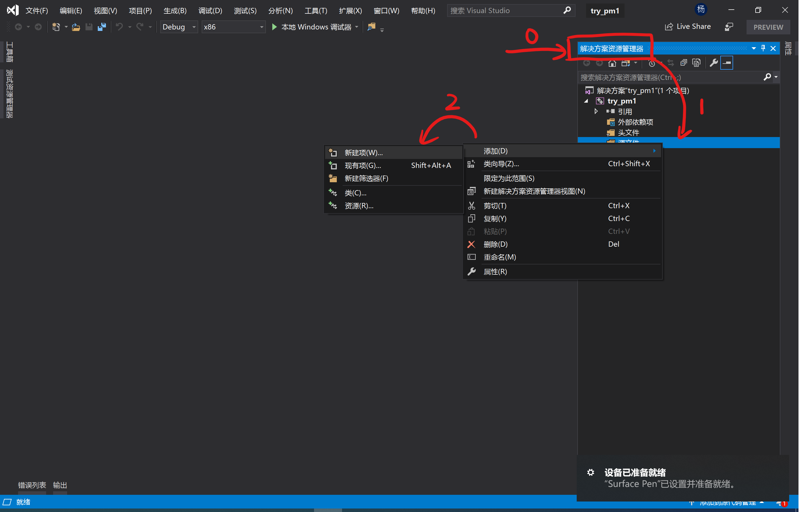

# 在 Visual Studio 中配置 PM1 SDK

1. 下载库文件

   访问 PM1 SDK 的 [GitHub 发布页](https://github.com/autolaborcenter/pm1_sdk/releases)，找到最新版本，下载库文件。

   

2. 打开 Visual Studio，建工程

   以 VS 2019 Preview 为例：

   

   

   

3. 安置项目文件

   

   0. 在侧边找到并展开 `解决方案资源管理器`
   1. 在 `源文件` 目录上按右键
   2. 选择 `添加/新建项`

   ---

   

   找到源文件目录：

   

   0. 在新建的文件标签上点击右键
   1. 选择 `打开所在的文件夹` 或 `打开文件所在位置`

   ---

   将下载的头文件和库文件移动到源文件目录：

   

   添加头文件到工程：

   

   

4. 写代码

   在 `源.cpp` 中添加下面的代码：

   ```c++
   #include "pm1_sdk.h"            // 添加头文件
   using namespace autolabor::pm1; // 打开命名空间
   
   #pragma comment(lib, "pm1_sdk_debug.lib") // 加载静态库
   
   int main() {
   	if (initialize()) {          // 初始化底盘连接
   		turn_around(0.75, 3.14); // 原地旋转半圈
   		return 0;
   	}
   	else {
   		return 1; // 初始化失败，退出
   	}
   }
   ```

   
